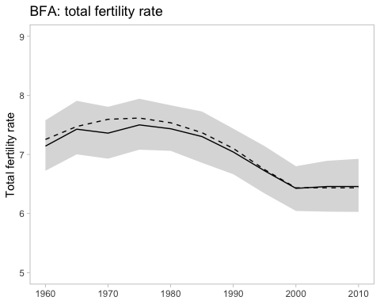

<!-- README.md is generated from README.Rmd. Please edit that file -->

# leapfrog

<!-- badges: start -->

[](https://travis-ci.org/mrc-ide/leapfrog)
[](https://ci.appveyor.com/project/mrc-ide/leapfrog)
[](https://codecov.io/gh/mrc-ide/leapfrog?branch=master)
<!-- badges: end -->

Leapfrog is a multistate population projection model for demographic and
HIV epidemic estimation.

The name *leapfrog* is in honor of
[Professor](https://blogs.lshtm.ac.uk/alumni/2018/07/16/obituary-professor-basia-zaba/)
Basia
[Zaba](https://translate.google.co.uk/#view=home&op=translate&sl=pl&tl=en&text=%C5%BBaba).

## Installation

Install the development version from
[GitHub](https://github.com/mrc-ide/leapfrog) via devtools:

``` r
# install.packages("devtools")
devtools::install_github("mrc-ide/leapfrog")
```

## Example

Construct a sparse Leslie matrix:

``` r
library(tidyverse)
library(leapfrog)
library(popReconstruct)
#> Loading required package: coda

data(burkina_faso_females)

make_leslie_matrixR(sx = burkina.faso.females$survival.proportions[,1],
                    fx = burkina.faso.females$fertility.rates[4:10, 1],
                    srb = 1.05,
                    age_span = 5,
                    fx_idx = 4)
#> 17 x 17 sparse Matrix of class "dgCMatrix"
#>                                                                                                                                                  
#>  [1,] .         .         0.2090608 0.5400452 0.6110685 0.5131988 0.3952854 0.2440665 0.1012326 0.01816255 .        .         .         .        
#>  [2,] 0.8782273 .         .         .         .         .         .         .         .         .          .        .         .         .        
#>  [3,] .         0.9713785 .         .         .         .         .         .         .         .          .        .         .         .        
#>  [4,] .         .         0.9730318 .         .         .         .         .         .         .          .        .         .         .        
#>  [5,] .         .         .         0.9577709 .         .         .         .         .         .          .        .         .         .        
#>  [6,] .         .         .         .         0.9481755 .         .         .         .         .          .        .         .         .        
#>  [7,] .         .         .         .         .         0.9460075 .         .         .         .          .        .         .         .        
#>  [8,] .         .         .         .         .         .         0.9393766 .         .         .          .        .         .         .        
#>  [9,] .         .         .         .         .         .         .         0.9258789 .         .          .        .         .         .        
#> [10,] .         .         .         .         .         .         .         .         0.9052283 .          .        .         .         .        
#> [11,] .         .         .         .         .         .         .         .         .         0.87537666 .        .         .         .        
#> [12,] .         .         .         .         .         .         .         .         .         .          0.832338 .         .         .        
#> [13,] .         .         .         .         .         .         .         .         .         .          .        0.7736165 .         .        
#> [14,] .         .         .         .         .         .         .         .         .         .          .        .         0.6966118 .        
#> [15,] .         .         .         .         .         .         .         .         .         .          .        .         .         0.5928803
#> [16,] .         .         .         .         .         .         .         .         .         .          .        .         .         .        
#> [17,] .         .         .         .         .         .         .         .         .         .          .        .         .         .        
#>                                    
#>  [1,] .         .         .        
#>  [2,] .         .         .        
#>  [3,] .         .         .        
#>  [4,] .         .         .        
#>  [5,] .         .         .        
#>  [6,] .         .         .        
#>  [7,] .         .         .        
#>  [8,] .         .         .        
#>  [9,] .         .         .        
#> [10,] .         .         .        
#> [11,] .         .         .        
#> [12,] .         .         .        
#> [13,] .         .         .        
#> [14,] .         .         .        
#> [15,] .         .         .        
#> [16,] 0.4547571 .         .        
#> [17,] .         0.3181678 0.2099861
```

Simulate a cohort component population
projection:

``` r
pop_proj <- ccmppR(basepop = as.numeric(burkina.faso.females$baseline.pop.counts),
                   sx = burkina.faso.females$survival.proportions,
                   fx = burkina.faso.females$fertility.rates[4:10, ],
                   gx = burkina.faso.females$migration.proportions,
                   srb = rep(1.05, ncol(burkina.faso.females$survival.proportions)),
                   age_span = 5,
                   fx_idx = 4)
pop_proj[ , c(1, 2, ncol(pop_proj))]
#>         [,1]       [,2]       [,3]
#>  [1,] 386000 496963.688 1369041.17
#>  [2,] 292000 338995.727 1088715.23
#>  [3,] 260000 283642.516  952860.73
#>  [4,] 244000 246278.270  846073.20
#>  [5,] 207000 221576.949  719894.38
#>  [6,] 175000 186062.343  572001.86
#>  [7,] 153000 156791.159  458905.67
#>  [8,] 135000 136059.686  379925.83
#>  [9,] 117000 118338.831  309642.33
#> [10,]  98000 100304.139  208006.24
#> [11,]  78000  81282.772  154298.67
#> [12,]  60000  63137.000  114066.08
#> [13,]  43000  46416.989   90879.78
#> [14,]  29000  29954.307   65876.04
#> [15,]  17000  17193.530   41985.79
#> [16,]   8000   7730.870   22044.43
#> [17,]   2000   2965.314   11332.85
```

### TMB

Calculate a population projection in TMB. Carry forward 2000 values for
two further periods to explore projections.

``` r

basepop_init <- as.numeric(burkina.faso.females$baseline.pop.counts)

sx_init <- burkina.faso.females$survival.proportions
sx_init <- cbind(sx_init, `2005` = sx_init[ , "2000"], `2010` = sx_init[ , "2000"])

fx_init <- burkina.faso.females$fertility.rates[4:10, ]
fx_init <- cbind(fx_init, `2005` = fx_init[ , "2000"], `2010` = fx_init[ , "2000"])

gx_init <- burkina.faso.females$migration.proportions
gx_init <- cbind(gx_init, `2005` = gx_init[ , "2000"], `2010` = gx_init[ , "2000"])

log_basepop_mean <- as.vector(log(basepop_init))
logit_sx_mean <- as.vector(qlogis(sx_init))
log_fx_mean <- as.vector(log(fx_init))
gx_mean <- as.vector(gx_init)
  
data <- list(log_basepop_mean = log_basepop_mean,
             logit_sx_mean = logit_sx_mean,
             log_fx_mean = log_fx_mean,
             gx_mean = gx_mean,
             srb = rep(1.05, ncol(sx_init)),
             age_span = 5,
             n_steps = ncol(sx_init),
             fx_idx = 4L,
             fx_span = 7L,
             census_log_pop = log(burkina.faso.females$census.pop.counts),
             census_year_idx = c(4L, 6L, 8L, 10L))
par <- list(log_tau2_logpop = 0,
            log_tau2_sx = 0,
            log_tau2_fx = 0,
            log_tau2_gx = 0,
            log_basepop = log_basepop_mean,
            logit_sx = logit_sx_mean,
            log_fx = log_fx_mean,
            gx = gx_mean)

obj <- make_tmb_obj(data, par)

obj$fn()
#> [1] 110.8335
#> attr(,"logarithm")
#> [1] TRUE

matrix(obj$report()$population, nrow = 17)[ , data$census_year_idx]
#>             [,1]       [,2]       [,3]       [,4]
#>  [1,] 586299.168 753003.656 962489.176 1252978.16
#>  [2,] 459242.300 598045.584 775198.946 1008185.99
#>  [3,] 394553.653 503462.586 657974.445  869072.03
#>  [4,] 315992.069 422558.078 557023.454  753945.02
#>  [5,] 250625.530 346908.252 454997.405  641580.04
#>  [6,] 210429.292 272236.861 371919.407  528990.03
#>  [7,] 189557.388 215524.244 304938.785  434418.70
#>  [8,] 159122.133 181456.243 240261.828  354780.52
#>  [9,] 135284.233 163936.098 188471.502  287730.98
#> [10,] 118315.492 134372.105 156718.080  223084.83
#> [11,]  99280.765 109659.465 137829.574  170540.89
#> [12,]  81464.594  91618.592 108025.671  133830.94
#> [13,]  61818.277  72442.566  84186.123  109726.37
#> [14,]  42765.853  52675.517  62806.965   77759.38
#> [15,]  24274.364  32049.045  39847.691   50071.95
#> [16,]  11286.657  15250.511  20411.382   26561.60
#> [17,]   4538.638   5972.196   9158.649   12697.11

input <- list(data = data, par_init = par)
fit <- fit_tmb(input)
#>   0:     110.83349:  0.00000  0.00000  0.00000  0.00000
#>   1:     24.892728:  3.47909 0.328263 0.303597  1.92250
#>   2:    -39.081896:  5.44273  1.52064  1.06743  5.10666
#>   3:    -56.306496:  6.80894  2.66742  1.68368  4.98032
#>   4:    -56.845045:  6.34157  3.88053  2.61444  5.99075
#>   5:    -64.797080:  6.63179  3.87162  2.76071  5.10270
#>   6:    -66.807665:  6.84558  4.12277  3.61226  5.34850
#>   7:    -68.296168:  6.65362  4.16468  4.52944  5.22802
#>   8:    -68.630793:  6.74695  4.37864  5.18194  5.02382
#>   9:    -68.736453:  6.68438  4.50870  4.91524  5.05102
#>  10:    -68.738063:  6.69140  4.51487  4.94850  5.05221
#>  11:    -68.738076:  6.69265  4.51519  4.94882  5.05129
#>  12:    -68.738077:  6.69239  4.51545  4.94908  5.05136
#>  13:    -68.738077:  6.69241  4.51543  4.94903  5.05137
#> converged: relative convergence (4)

fit[1:6]
#> $par
#> log_tau2_logpop     log_tau2_sx     log_tau2_fx     log_tau2_gx 
#>        6.692407        4.515433        4.949035        5.051373 
#> 
#> $objective
#> [1] -68.73808
#> 
#> $convergence
#> [1] 0
#> 
#> $iterations
#> [1] 13
#> 
#> $evaluations
#> function gradient 
#>       18       14 
#> 
#> $message
#> [1] "relative convergence (4)"
```

Sample from posterior distribution and generate outputs

``` r
fit <- sample_tmb(fit)

colnames(fit$sample$population) <- 1:ncol(fit$sample$population)
colnames(fit$sample$fx) <- 1:ncol(fit$sample$fx)

init_pop_mat <- ccmpp_leslieR(basepop_init, sx_init, fx_init, gx_init,
                              srb = rep(1.05, ncol(sx_init)), age_span = 5, fx_idx = 4)

df <- crossing(year = seq(1960, 2015, 5),
               sex = "female",
               age_group = c(sprintf("%02d-%02d", 0:15*5, 0:15*5+4), "80+")) %>%
  mutate(init_pop = as.vector(init_pop_mat))

census_pop <- crossing(sex = "female",
                       age_group = c(sprintf("%02d-%02d", 0:15*5, 0:15*5+4), "80+")) %>%
  bind_cols(as_tibble(burkina.faso.females$census.pop.counts)) %>%
  gather(year, census_pop, `1975`:`2005`) %>%
  type_convert(cols(year = col_double()))

df <- df %>%
  left_join(census_pop) %>%
  bind_cols(as_tibble(fit$sample$population)) %>%
  gather(sample, value, `1`:last_col())
#> Joining, by = c("year", "sex", "age_group")

agepop <- df %>%
  group_by(year, sex, age_group) %>%
  summarise(init_pop = mean(init_pop),
            census_pop = mean(census_pop),
            mean = mean(value),
            lower = quantile(value, 0.025),
            upper = quantile(value, 0.975))

totalpop <- df %>%
  group_by(year, sample) %>%
  summarise(init_pop = sum(init_pop),
            census_pop = sum(census_pop),
            value = sum(value)) %>%
  group_by(year) %>%
  summarise(init_pop = mean(init_pop),
            census_pop = mean(census_pop),
            mean = mean(value),
            lower = quantile(value, 0.025),
            upper = quantile(value, 0.975))
```

``` r
ggplot(totalpop, aes(year, mean, ymin = lower, ymax = upper)) +
  geom_ribbon(alpha = 0.2) +
  geom_line() +
  geom_line(aes(y = init_pop), linetype = "dashed") +
  geom_point(aes(y = census_pop), shape = 4, color = "darkred", stroke = 2) +
  scale_y_continuous("Total population (millions)", labels = scales::number_format(scale = 1e-6)) +
  expand_limits(y = 0) +
  labs(x = NULL) +
  theme_light() +
  ggtitle("BFA females: total population")
#> Warning: Removed 8 rows containing missing values (geom_point).
```


``` r
ggplot(agepop, aes(age_group, mean, ymin = lower, ymax = upper, group = 1)) +
  geom_ribbon(alpha = 0.2) +
  geom_line() +
  geom_line(aes(y = init_pop), linetype = "dashed") +
  geom_point(aes(y = census_pop), color = "darkred") +
  facet_wrap(~year, scales = "free_y") + 
  scale_y_continuous("Total population (thousands)", labels = scales::number_format(scale = 1e-3)) +
  expand_limits(y = 0) +
  theme_light() +
  theme(axis.text.x = element_text(angle = 30, hjust = 1),
        panel.grid = element_blank()) +
  ggtitle("BFA females: population by age")
#> Warning: Removed 136 rows containing missing values (geom_point).
```


Posterior distribution for TFR:

``` r

asfr <- crossing(year = seq(1960, 2010, 5),
                 age_group = sprintf("%02d-%02d", 3:9*5, 3:9*5+4)) %>%
  mutate(init_asfr = as.vector(fx_init)) %>%
  bind_cols(as_tibble(fit$sample$fx)) %>%
  gather(sample, value, `1`:last_col()) 

tfr <- asfr %>%
  group_by(year, sample) %>%
  summarise(init_tfr = 5 * sum(init_asfr),
            value = 5 * sum(value)) %>%
  group_by(year) %>%
  summarise(init_tfr = mean(init_tfr),
         mean = mean(value),
         lower = quantile(value, 0.025),
         upper = quantile(value, 0.975))

ggplot(tfr, aes(year, mean, ymin = lower, ymax = upper)) +
  geom_ribbon(alpha = 0.2) +
  geom_line() +
  geom_line(aes(y = init_tfr), linetype = "dashed") +
  scale_y_continuous("Total fertility rate", limits = c(5, 9)) +
  labs(x = NULL) +
  theme_light() +
  theme(panel.grid = element_blank()) +
  ggtitle("BFA: total fertility rate")
```



## Development notes

The simulation model is implemented as templated C++ code in
`src/ccmpp.h` such that the simulation model may be developed as a
standalone C++ library that can be called by other software without
requiring R-specific code features.

  - Presently the CCMPP model is implemented as a sparse Leslie matrix
    formulation. In future, this will probably be split into multiple
    steps to save intermediate computations of demographic events
    (births, deaths, migrations).
  - In future a class structure will probably be developed.
  - Specifying static dimensions for the state space may improve
    efficiency. This should be possible for common options (5x5 year,
    1x1 year) through templating.

The file `src/ccmppR.cpp` contains R wrapper functions for the model
simulation via [Rcpp](http://dirk.eddelbuettel.com/code/rcpp.html) and
[RcppEigen](http://dirk.eddelbuettel.com/code/rcpp.eigen.html).

The objective function (the negative log posterior) is implemented in
templated C++ code using probability functions from the Template Model
Builder ([TMB](https://github.com/kaskr/adcomp/wiki)) R package.
Implementation in TMB provides gradient functions via automatic
differentiation (AD).

  - Further investigation is needed about the portability of AD
    objective function DLLs outside of the R environment.

TMB also contains R functions for approximation integration of arbitrary
random effects via Laplace approximation.

TMB model code and testing are implemented following templates from the
[`TMBtools`](https://github.com/mlysy/TMBtools) package with guidance
for package development with both TMB models and Rcpp code. \* To add a
new TMB model, save the model template in the `src/TMB` with extension
`.hpp`. The model name must match the file name. The signature is
slightly different – see other `.hpp` files for example. \* Call
`TMBtools::export_models()` to export the new TMB model to the
meta-model list. \* When constructing the objective function with
`TMB::MakeADFun`, use `DLL= "leapfrog_TMBExports"` and add an additional
value `model = "<model_name>"` to the `data` list.
